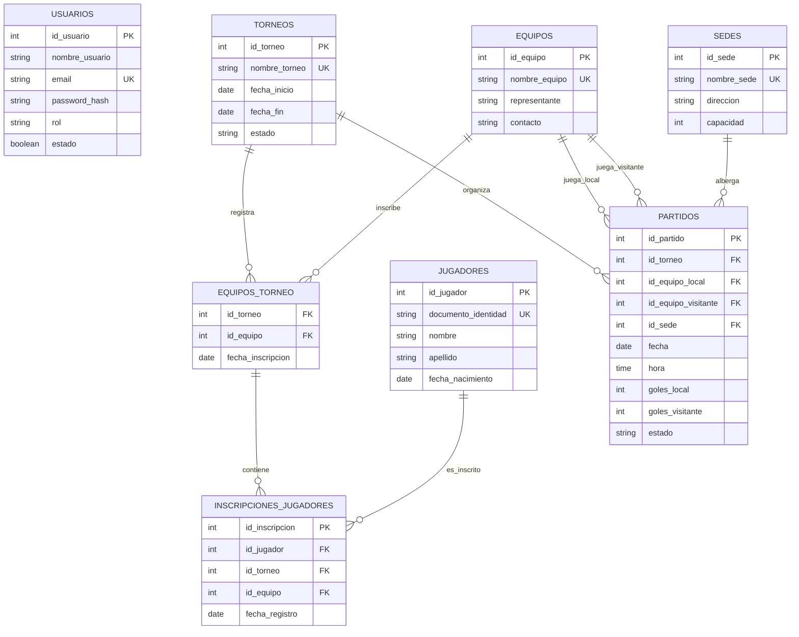

# Sistema de Gestión de Liga Deportiva – Liga Amateur de Fútbol Municipal

Este proyecto consiste en el diseño, modelado de base de datos y propuesta de implementación de una solución web bajo arquitectura MVC para la administración de la Liga Amateur de Fútbol Municipal, la cual gestiona torneos locales entre equipos de barrios y empresas.

---

## 1. Análisis del Problema

El objetivo principal es resolver los problemas actuales de gestión manual y hojas de cálculo (Excel) tales como la programación de partidos conflictiva, la duplicación de jugadores en equipos y las inconsistencias en las tablas de posiciones.

### Entidades Principales
*   **Usuario**: Personal administrativo que gestiona el sistema (Roles: Administrador, Planillero).
*   **Equipo**: Clubes deportivos de barrios o empresas locales.
*   **Jugador**: Deportista inscrito en la liga.
*   **Sede**: Espacios físicos (canchas/polideportivos) donde se juegan los partidos.
*   **Torneo**: Campeonatos organizados por la liga (ej. Torneo de Apertura, Torneo de Clausura).

### Entidades Asociativas
*   **Equipo_Torneo (Inscripción de Equipo)**: Asocia los equipos que participan en un torneo específico.
*   **Inscripcion_Jugador**: Asocia a un jugador con un equipo dentro de un torneo específico. Esto permite que un jugador cambie de equipo en diferentes torneos, pero restringe su duplicidad en el mismo torneo.
*   **Partido**: Asocia dos equipos (local y visitante), una sede, y un torneo, definiendo fecha, hora, estado y el resultado de goles.

### Atributos Clave
*   **Usuario**: `id_usuario` (PK), `nombre_usuario`, `email` (UQ), `password_hash`, `rol` (Admin/Planillero), `estado` (Activo/Inactivo).
*   **Equipo**: `id_equipo` (PK), `nombre_equipo` (UQ), `representante`, `contacto`, `logo_url`.
*   **Jugador**: `id_jugador` (PK), `documento_identidad` (UQ), `nombre`, `apellido`, `fecha_nacimiento`, `telefono`.
*   **Sede**: `id_sede` (PK), `nombre_sede` (UQ), `direccion`, `capacidad`.
*   **Torneo**: `id_torneo` (PK), `nombre_torneo` (UQ), `fecha_inicio`, `fecha_fin`, `estado` (Borrador/Activo/Finalizado).
*   **Partido**: `id_partido` (PK), `id_torneo` (FK), `id_equipo_local` (FK), `id_equipo_visitante` (FK), `id_sede` (FK), `fecha`, `hora`, `goles_local`, `goles_visitante`, `estado` (Programado/En Juego/Finalizado/Cancelado).

### Relaciones y Cardinalidades
*   **Equipo a Equipo_Torneo**: Uno a Muchos ($1:N$). Un equipo puede inscribirse en muchos torneos.
*   **Torneo a Equipo_Torneo**: Uno a Muchos ($1:N$). Un torneo alberga muchos equipos.
*   **Jugador a Inscripcion_Jugador**: Uno a Muchos ($1:N$). Un jugador puede tener múltiples inscripciones a lo largo del tiempo.
*   **Equipo_Torneo a Inscripcion_Jugador**: Uno a Muchos ($1:N$). Una inscripción de equipo en un torneo tiene muchos jugadores inscritos.
*   **Torneo a Partido**: Uno a Muchos ($1:N$). Un torneo consta de muchos partidos programados.
*   **Sede a Partido**: Uno a Muchos ($1:N$). Una sede puede albergar muchos partidos en diferentes fechas y horas.
*   **Equipo a Partido (Local / Visitante)**: Uno a Muchos ($1:N$). Un equipo puede jugar múltiples partidos de local o de visitante.

---

## 2. Modelo Entidad-Relación (MER)

### Claves y Relaciones Detalladas
*   `usuarios`: PK (`id_usuario`).
*   `equipos`: PK (`id_equipo`).
*   `jugadores`: PK (`id_jugador`), UK (`documento_identidad`).
*   `sedes`: PK (`id_sede`).
*   `torneos`: PK (`id_torneo`).
*   `equipos_torneo`: PK (`id_torneo`, `id_equipo`), FK (`id_torneo` ref `torneos`), FK (`id_equipo` ref `equipos`).
*   `inscripciones_jugadores`: PK (`id_inscripcion`), FK (`id_torneo`, `id_equipo` ref `equipos_torneo`), FK (`id_jugador` ref `jugadores`), UK (`id_jugador`, `id_torneo`) para evitar que juegue en dos equipos el mismo torneo.
*   `partidos`: PK (`id_partido`), FK (`id_torneo` ref `torneos`), FK (`id_equipo_local` ref `equipos`), FK (`id_equipo_visitante` ref `equipos`), FK (`id_sede` ref `sedes`).

### Diagrama MER (Mermaid)



---

## 3. Modelo Relacional

### Tablas y Atributos

1.  **usuarios** (`id_usuario` INT AUTO_INCREMENT PK, `nombre_usuario` VARCHAR(50) NOT NULL, `email` VARCHAR(100) UNIQUE NOT NULL, `password_hash` VARCHAR(255) NOT NULL, `rol` ENUM('Admin', 'Planillero') NOT NULL, `estado` TINYINT(1) DEFAULT 1, `created_at` TIMESTAMP DEFAULT CURRENT_TIMESTAMP)
2.  **equipos** (`id_equipo` INT AUTO_INCREMENT PK, `nombre_equipo` VARCHAR(100) UNIQUE NOT NULL, `representante` VARCHAR(100) NOT NULL, `contacto` VARCHAR(50), `logo_url` VARCHAR(255))
3.  **jugadores** (`id_jugador` INT AUTO_INCREMENT PK, `documento_identidad` VARCHAR(20) UNIQUE NOT NULL, `nombre` VARCHAR(50) NOT NULL, `apellido` VARCHAR(50) NOT NULL, `fecha_nacimiento` DATE NOT NULL, `telefono` VARCHAR(20))
4.  **sedes** (`id_sede` INT AUTO_INCREMENT PK, `nombre_sede` VARCHAR(100) UNIQUE NOT NULL, `direccion` VARCHAR(150) NOT NULL, `capacidad` INT CHECK (`capacidad` >= 0))
5.  **torneos** (`id_torneo` INT AUTO_INCREMENT PK, `nombre_torneo` VARCHAR(100) UNIQUE NOT NULL, `fecha_inicio` DATE NOT NULL, `fecha_fin` DATE NOT NULL, `estado` ENUM('Borrador', 'Activo', 'Finalizado') DEFAULT 'Borrador', CHECK (`fecha_fin` >= `fecha_inicio`))
6.  **equipos_torneo** (`id_torneo` INT, `id_equipo` INT, `fecha_inscripcion` DATE DEFAULT (CURRENT_DATE), PRIMARY KEY (`id_torneo`, `id_equipo`), FOREIGN KEY (`id_torneo`) REFERENCES `torneos`(`id_torneo`) ON DELETE CASCADE, FOREIGN KEY (`id_equipo`) REFERENCES `equipos`(`id_equipo`) ON DELETE CASCADE)
7.  **inscripciones_jugadores** (`id_inscripcion` INT AUTO_INCREMENT PK, `id_jugador` INT NOT NULL, `id_torneo` INT NOT NULL, `id_equipo` INT NOT NULL, `fecha_registro` DATE DEFAULT (CURRENT_DATE), FOREIGN KEY (`id_jugador`) REFERENCES `jugadores`(`id_jugador`) ON DELETE CASCADE, FOREIGN KEY (`id_torneo`, `id_equipo`) REFERENCES `equipos_torneo`(`id_torneo`, `id_equipo`) ON DELETE CASCADE, UNIQUE (`id_jugador`, `id_torneo`))
    *   *Nota*: La clave UNIQUE (`id_jugador`, `id_torneo`) asegura que un jugador no pertenezca a dos equipos en el mismo torneo.
8.  **partidos** (`id_partido` INT AUTO_INCREMENT PK, `id_torneo` INT NOT NULL, `id_equipo_local` INT NOT NULL, `id_equipo_visitante` INT NOT NULL, `id_sede` INT NOT NULL, `fecha` DATE NOT NULL, `hora` TIME NOT NULL, `goles_local` INT DEFAULT NULL CHECK (`goles_local` >= 0), `goles_visitante` INT DEFAULT NULL CHECK (`goles_visitante` >= 0), `estado` ENUM('Programado', 'En Juego', 'Finalizado', 'Cancelado') DEFAULT 'Programado', FOREIGN KEY (`id_torneo`) REFERENCES `torneos`(`id_torneo`), FOREIGN KEY (`id_equipo_local`) REFERENCES `equipos`(`id_equipo`), FOREIGN KEY (`id_equipo_visitante`) REFERENCES `equipos`(`id_equipo`), FOREIGN KEY (`id_sede`) REFERENCES `sedes`(`id_sede`), CHECK (`id_equipo_local` <> `id_equipo_visitante`), UNIQUE (`id_sede`, `fecha`, `hora`))
    *   *Nota*: La restricción UNIQUE (`id_sede`, `fecha`, `hora`) asegura que no se jueguen dos partidos en la misma sede en el mismo momento.

### Índices Recomendados
*   `idx_partidos_fecha_hora`: Acelera la búsqueda de colisión de horarios y listados de fixture.
*   `idx_partidos_equipos`: En `id_equipo_local` e `id_equipo_visitante` para optimizar consultas de rendimiento de equipos.
*   `idx_inscripciones_jugador`: En `id_jugador` para buscar rápidamente el historial de un jugador.

---

## 4. Arquitectura MVC

El proyecto sigue el patrón **Modelo-Vista-Controlador (MVC)** para garantizar una separación limpia de responsabilidades y mantenibilidad del software.

```
/DEPORTE
│   index.html              # Interfaz de usuario interactiva y simulador SPA
│   styles.css              # Hoja de estilos premium
│   app.js                  # Lógica del frontend y motor de simulación
│   README.md               # Documentación general
│
├───config/
│       db.js               # Conexión a la base de datos MySQL (Node.js/Sequelize o PHP PDO)
│
├───controllers/
│       UsuarioController.js # CRUD y autenticación de usuarios
│       EquipoController.js  # CRUD de equipos e inscripción en torneos
│       JugadorController.js # CRUD de jugadores e inscripciones
│       PartidoController.js # Programación, validación de reglas y marcador
│       TorneoController.js  # CRUD de torneos y cálculo de tabla de posiciones
│
├───models/
│       Usuario.js          # Definición del modelo de Usuario
│       Equipo.js           # Definición del modelo de Equipo
│       Jugador.js          # Definición del modelo de Jugador
│       Sede.js             # Definición del modelo de Sede
│       Torneo.js           # Definición del modelo de Torneo
│       Partido.js          # Definición del modelo de Partido
│
├───views/
│   ├───auth/
│   │       login.ejs       # Vista de inicio de sesión
│   ├───dashboard/
│   │       index.ejs       # Panel principal con accesos y resúmenes
│   ├───equipos/
│   │       list.ejs        # Lista y CRUD de equipos
│   ├───jugadores/
│   │       list.ejs        # Lista y CRUD de jugadores
│   ├───partidos/
│   │       fixture.ejs     # Programación de partidos y carga de resultados
│   └───posiciones/
│           table.ejs       # Tabla de posiciones del torneo seleccionado
│
├───routes/
│       authRoutes.js       # Rutas de login y logout
│       adminRoutes.js      # Rutas para CRUDs y configuraciones
│       partidoRoutes.js    # Rutas para el control de partidos y resultados
│
├───database/
│       schema.sql          # Estructura DDL de la base de datos
│       seeds.sql           # Datos semilla (DML)
│       queries.sql         # Consultas SQL avanzadas y tabla de posiciones
│
└───public/
    ├───css/                # Hojas de estilo secundarias
    ├───js/                 # Scripts auxiliares frontend
    └───uploads/            # Logos de equipos y fotos de jugadores
```

### Funciones de cada Carpeta
*   **/config**: Almacena variables de entorno y archivos de configuración global del sistema (e.g. acceso a base de datos).
*   **/controllers**: Contiene la lógica de negocio. Procesa las solicitudes del usuario, interactúa con el modelo y decide qué vista renderizar o qué respuesta JSON retornar.
*   **/models**: Representa los datos y encapsula la lógica de acceso a la base de datos. Implementa las consultas y valida los datos antes de persistirlos.
*   **/views**: Las plantillas de interfaz de usuario que se le presentan al cliente final.
*   **/routes**: Mapea las URL o endpoints hacia las funciones correspondientes de los controladores.
*   **/public**: Contiene los archivos estáticos de acceso directo para el navegador (CSS, imágenes, JS de cliente).
*   **/database**: Contiene los scripts SQL de inicialización, datos de prueba e informes.

---

## 5. Casos de Uso del Sistema

### Actores
*   **Administrador**: Acceso total a la configuración del sistema, CRUDs de usuarios, equipos, jugadores, sedes, torneos y asignación de roles.
*   **Planillero**: Encargado de registrar partidos, sedes y cargar los marcadores en tiempo real.
*   **Visitante (Público)**: Consulta la tabla de posiciones, fixtures y partidos programados.

### Diagrama de Casos de Uso (Mermaid)

```mermaid
flowchart TD
    actor Admin as Administrador
    actor Planillero as Planillero
    actor Publico as Visitante (Público)

    subgraph Casos de Uso
        UC1(Autenticarse en el Sistema)
        UC2(Gestionar Usuarios)
        UC3(Gestionar Equipos)
        UC4(Gestionar Jugadores)
        UC5(Gestionar Torneos)
        UC6(Inscribir Equipo en Torneo)
        UC7(Inscribir Jugador en Equipo por Torneo)
        UC8(Programar Partidos)
        UC9(Registrar Resultados de Partidos)
        UC10(Consultar Fixture y Resultados)
        UC11(Consultar Tabla de Posiciones)
    end

    Admin --> UC1
    Admin --> UC2
    Admin --> UC3
    Admin --> UC4
    Admin --> UC5
    Admin --> UC6
    Admin --> UC7
    Admin --> UC8
    Admin --> UC9
    
    Planillero --> UC1
    Planillero --> UC8
    Planillero --> UC9
    
    Publico --> UC10
    Publico --> UC11

    UC8 -.->|include| UC6
    UC9 -.->|extend| UC8
```

---

## 6. Diseño de Interfaces (UI/UX)

A continuación se detalla la descripción de las vistas del sistema:

### A. Login
*   **Campos**: Correo Electrónico (`email`), Contraseña (`password`).
*   **Botones**: "Iniciar Sesión", "Restablecer Contraseña".
*   **Validaciones**: Correo con formato válido, campos requeridos.
*   **Mensajes**:
    - *Error*: "Credenciales incorrectas" o "Usuario inactivo".
    - *Confirmación*: Redirección exitosa al Dashboard.

### B. Dashboard Principal
*   **Elementos**: Tarjetas informativas con estadísticas (Equipos registrados, Torneos activos, Próximos partidos, Sedes habilitadas). Accesos rápidos a planillar partidos y tablas.
*   **Interacciones**: Menú lateral (Sidebar) colapsable con accesos rápidos.

### C. CRUD Equipos / Jugadores / Torneos / Sedes
*   **Campos de Formulario**: Modales dinámicos con campos específicos (Nombre del equipo, Documento del jugador, Fechas del torneo, Dirección de sede).
*   **Botones**: "Guardar", "Cancelar", "Editar", "Eliminar".
*   **Validaciones**: Evitar duplicados de cédula, campos obligatorios, fechas de torneo coherentes (Inicio < Fin).
*   **Mensajes**:
    - *Confirmación*: "Equipo guardado correctamente", "¿Está seguro de eliminar este registro?".

### D. Programador de Partidos
*   **Campos**: Selector de Torneo, Selector de Equipo Local, Selector de Equipo Visitante, Sede, Fecha, Hora.
*   **Validaciones en Caliente (Reglas de Negocio)**:
    - Evitar mismo equipo como local y visitante.
    - Comprobación de disponibilidad de sede (Día y hora).
    - Comprobación de que los equipos no tengan otro partido programado ese mismo día.
    - Asegurar que el torneo tenga al menos 2 equipos inscritos.
*   **Mensaje de Error**: "La sede seleccionada ya tiene un partido programado para esta fecha y hora."

### E. Tabla de Posiciones
*   **Campos**: Selector de Torneo. Tabla con columnas: Posición, Equipo, PJ (Partidos Jugados), PG (Ganados), PE (Empatados), PP (Perdidos), GF (Goles a Favor), GC (Goles en Contra), DG (Diferencia de Goles), PTS (Puntos).
*   **Cálculo**: Automático al registrar los resultados de los partidos.

---

## 7. Validaciones de Negocio

El sistema implementa una arquitectura de seguridad y validación de datos en tres capas para asegurar la robustez de las reglas del negocio:

### Capa 1: Frontend (UX)
*   Usa validaciones HTML5 (`required`, `pattern`, `min`, `max`).
*   Usa JavaScript reactivo en los formularios para impedir que un usuario intente programar partidos con datos incoherentes o equipos duplicados.
*   Deshabilita botones de acción si el formulario es inválido.

### Capa 2: Backend (Controlador / Lógica de Negocio)
*   Antes de realizar cualquier inserción en la base de datos, el controlador ejecuta consultas para verificar si el equipo tiene partidos el mismo día o si la cancha está ocupada.
*   Se lanzan excepciones HTTP 400 (Bad Request) con descripciones claras en caso de que una regla de negocio sea infringida.

### Capa 3: Base de Datos (Integridad y Triggers)
*   **Restricciones de Tabla**: Claves primarias y foráneas impiden registros huérfanos. Las restricciones `UNIQUE` impiden colisiones de sedes y duplicidades de jugadores en un torneo.
*   **Triggers MySQL**: Se implementan desencadenadores de base de datos (`BEFORE INSERT ON partidos`) que actúan como última línea de defensa ante transacciones concurrentes o cargas masivas que intenten violar las reglas de fecha de partidos y equipos.

---

## 8. Repositorio GitHub y Estructura

El repositorio oficial debe contener el código estructurado en base a las convenciones MVC, acompañados del correspondiente archivo de configuración de dependencias de Node.js (`package.json`) y el archivo `.gitignore` para omitir la carpeta `node_modules` y archivos de entorno `.env`.

El archivo `README.md` actual sirve como documentación de arquitectura, base de datos y diseño del sistema para desarrolladores y evaluadores del proyecto.
